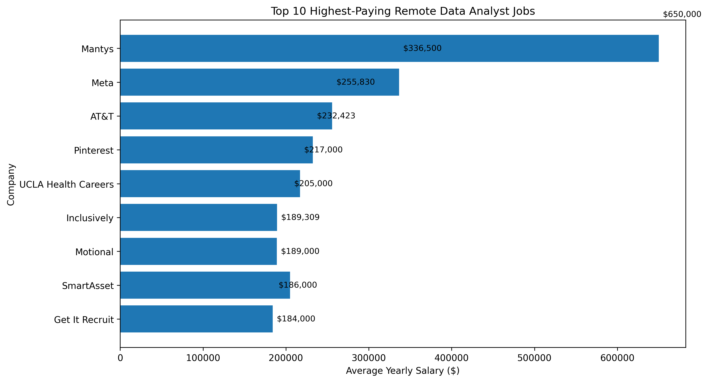

# Introduction
📊 Dive into the data job market! Focusing on data analyst roles, this project explores 💰 top-paying jobs, 🔥 in-demand skills, and 📈 where high demand meets high salary in data analytics.

💡 SQL queries? Check them out here: [project_sql](/project_sql/).
# Background
Driven by a quest to navigate the data analyst job market more effectively, this project was born from a desire to pinpoint top-paying and in-demand skills, helping aspiring analysts identify the most valuable opportunities in the field.


### The key questions explored through SQL were:

1. What are the top-paying Data Analyst jobs?
2. What skills are required for these top-paying jobs?
3. What skills are most in demand for Data Analysts?
4. Which skills are associated with higher salaries?
5. What are the most optimal skills to learn (high demand and high salary)?
# Tools I Used
## Tools I Used

To explore the data analyst job market and answer the project's key questions, I relied on several essential tools:

- **SQL:** The foundation of the analysis, used to query the database, filter data, perform aggregations, and uncover valuable insights.
- **PostgreSQL:** The database management system used to store and manage the job posting dataset efficiently.
- **Visual Studio Code (VS Code):** The primary development environment for writing, testing, and executing SQL queries.
- **Git & GitHub:** Used for version control, tracking project progress, and sharing SQL scripts and analysis in a collaborative and organized manner.
# The Analysis
### 1. Top Paying Data Analyst Jobs

To identify the highest-paying Data Analyst roles, I filtered job postings to include only remote positions with specified salary information. I then ranked these opportunities by average annual salary to highlight the most lucrative roles available in the market.
```
SELECT 
    j.job_id,
    c.name,
    j.job_title_short,
    j.job_location,
    j.job_schedule_type,
    j.salary_year_avg,
    j.job_posted_date
FROM
    job_postings_fact as j
LEFT JOIN
    company_dim as c
ON
    c.company_id = j.company_id
WHERE
    (job_title_short = 'Data Analyst' AND job_work_from_home = true)
    AND salary_year_avg IS NOT NULL
ORDER BY 
    salary_year_avg DESC
LIMIT 10; 

```

### Key Insights

Here's a breakdown of the top-paying Data Analyst jobs in 2023:

- **Wide Salary Range:** The top 10 highest-paying Data Analyst positions offered salaries ranging from **$184,000 to $650,000**, highlighting the strong earning potential within the field.

- **Diverse Employers:** Companies such as **SmartAsset, Meta, and AT&T** were among the organizations offering these high-paying opportunities, demonstrating demand for data analysts across various industries.

- **Varied Job Titles:** The highest-paying roles included a range of positions, from **Data Analyst** to **Director of Analytics**, reflecting the diverse career paths and specializations available within data analytics.

# What I learned
### What I Learned

Throughout this project, I strengthened my SQL skills and gained hands-on experience working with real-world job market data.

- **Complex Query Building:** Developed advanced SQL queries involving multiple table joins, subqueries, Common Table Expressions (CTEs), and filtering techniques to answer business-focused questions.

- **Data Aggregation & Analysis:** Used aggregate functions such as `COUNT()`, `AVG()`, and `GROUP BY` to uncover trends, measure demand, and analyze salary patterns across Data Analyst roles.

- **Analytical Problem Solving:** Improved my ability to translate real-world business questions into SQL queries and extract meaningful insights from large datasets.

- **Database Management:** Gained practical experience working with PostgreSQL to manage, query, and analyze structured data efficiently.

- **Version Control & Documentation:** Used Git and GitHub to track project progress, manage code versions, and document findings in a professional manner.
# Conclusion

## Insights

1. **Top-Paying Data Analyst Jobs:** The highest-paying remote Data Analyst roles offered salaries ranging from **$184,000 to $650,000**, demonstrating the strong earning potential available in the field.

2. **Skills Required for Top-Paying Jobs:** High-paying Data Analyst positions commonly require strong technical skills such as **SQL**, highlighting its importance in securing premium roles.

3. **Most In-Demand Skills:** **SQL** emerged as the most frequently requested skill across Data Analyst job postings, making it a foundational skill for aspiring analysts.

4. **Skills Associated with Higher Salaries:** Specialized skills such as **SVN** and **Solidity** were linked to the highest average salaries, suggesting that niche technical expertise can command a salary premium.

5. **Optimal Skills to Learn:** Skills that combine **high demand** with **high average salaries**, particularly **SQL**, provide the greatest value for Data Analysts seeking both career stability and strong compensation. 

## Closing Thoughts

This project strengthened my SQL skills while providing valuable insights into the Data Analyst job market. Through analyzing salary trends, skill demand, and the relationship between compensation and required expertise, I gained a deeper understanding of what drives success in the field.

The findings from this analysis can help aspiring Data Analysts make more informed decisions about skill development and career planning. By focusing on high-demand and high-paying skills, professionals can better position themselves in a competitive job market and maximize their career growth opportunities.

This project also reinforced the importance of continuous learning, adaptability, and data-driven decision-making in the ever-evolving world of data analytics. 
